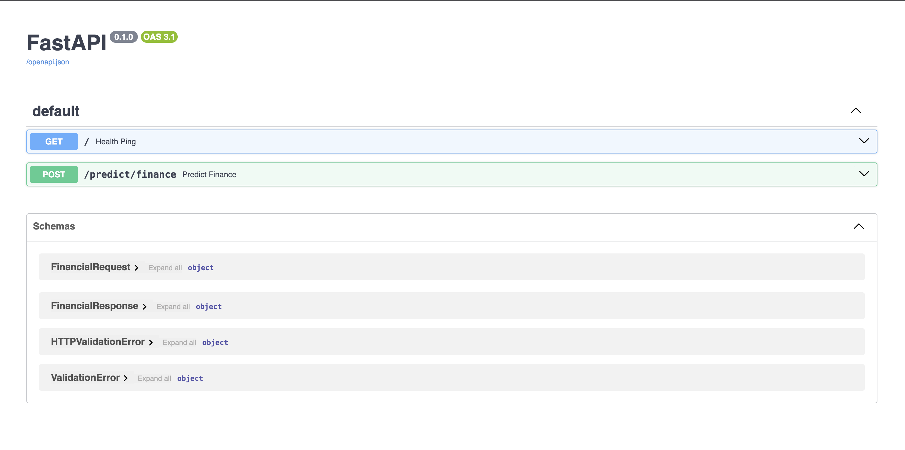
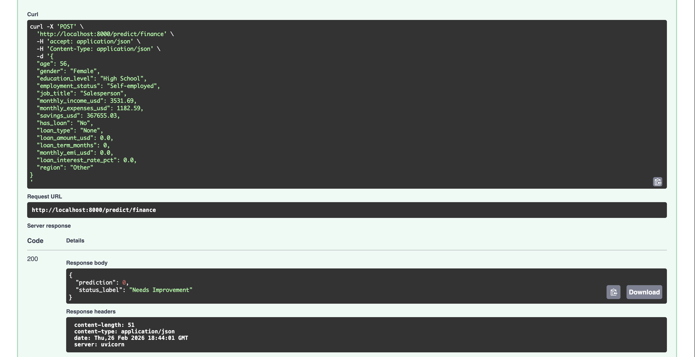

## Overview

I exposed ML models as APIs using [FastAPI](https://fastapi.tiangolo.com/) and [uvicorn](https://www.uvicorn.org/).
1. **FastAPI**: FastAPI is a modern, fast (high-performance), web framework for building APIs with Python based on standard Python type hints.
2. **uvicorn**: Uvicorn is an [Asynchronous Server Gateway Interface - ASGI](https://youtu.be/vKjCkeJGbNk) web server implementation for Python. It is often used to serve FastAPI aplications.

The workflow involves the following steps:
1. Training an XGBoost Classifier on a Personal Finance Dataset.
2. Serving the trained model via a REST API endpoint using FastAPI and uvicorn to predict an individual's financial condition.

## Setup

1. Create a virtual environment (e.g. `fastapi_env`):
   ```bash
   python3 -m venv fastapi_env
   ```
2. Activate the environment:
   - On macOS/Linux: `source fastapi_env/bin/activate`
   - On Windows: `fastapi_env\Scripts\activate`
3. Install the required packages using:
   ```bash
   pip install -r requirements.txt
   ```
4. Install the project in editable mode so imports resolve correctly:
   ```bash
   pip install -e .
   ```

### Project structure

```
fastapi
    ├── assets/                 # Images for documentation
    ├── fastapi_env/            # Virtual environment
    ├── data/
    │   └── financial_data.csv  # Raw training data
    ├── model/
    │   ├── financial_model.pkl # Trained XGBoost model
    │   └── categorical_encoder.pkl # Fitted Ordinal Encoder
    ├── src/
    │   ├── __init__.py
    │   ├── data.py             # Loads raw data
    │   ├── features.py         # Feature engineering & preprocessing
    │   ├── schemas.py          # Pydantic validation models
    │   ├── train.py            # Model training script
    │   ├── predict.py          # Model inference script
    │   └── main.py             # FastAPI application
    ├── README.md
    ├── pyproject.toml          # Project metadata and editable install config
    └── requirements.txt
```

## Execution

1. The first step is to train the XGBoost Classifier. We've structured the code using SOLID principles, separating data loading, feature engineering, and model training. To train the model, run:
    ```bash
    python3 src/train.py
    ```
    *(This will load `data/financial_data.csv`, encode the categorical variables, train the XGBoost model, and output `model/financial_model.pkl` along with `model/categorical_encoder.pkl`.)*

2. To serve the trained model as an API, start the web server:
    ```bash
    uvicorn src.main:app --reload
    ```
3. **Testing endpoints**: To view the interactive documentation of your API you can visit [http://127.0.0.1:8000/docs](http://127.0.0.1:8000/docs) (or [http://localhost:8000/docs](http://localhost:8000/docs)) after starting your FastAPI app.
    
    
   
    You can also test the results of your endpoints by interacting with them directly in the browser. Click on the downward arrow beside the `POST /predict/finance` endpoint -> Click **Try it out** -> Fill the Request body with JSON data -> Click on the **Execute** button.

    

4. **Data Models in FastAPI**:
    My API uses Pydantic to ensure the incoming data matches exactly what the XGBoost model expects. This is handled in `src/schemas.py`.
    
    - **`FinancialRequest`**: Validates the input payload containing a user's age, income, existing loans, etc., ensuring they are the correct data types before making a prediction.
    - **`FinancialResponse`**: Formats the output array from XGBoost (e.g., `[1]`) into a clean JSON response containing both the integer prediction and a human-readable `status_label` (e.g., "Good" or "Needs Improvement").

- I can also use other tools like [Postman](https://www.postman.com/) or `curl` on the command line for API testing. For example:
  ```bash
  curl -X 'POST' \
    'http://127.0.0.1:8000/predict/finance' \
    -H 'accept: application/json' \
    -H 'Content-Type: application/json' \
    -d '{
    "age": 56,
    "gender": "Female",
    "education_level": "High School",
    "employment_status": "Self-employed",
    "job_title": "Salesperson",
    "monthly_income_usd": 3531.69,
    "monthly_expenses_usd": 1182.59,
    "savings_usd": 367655.03,
    "has_loan": "No",
    "loan_type": "None",
    "loan_amount_usd": 0.0,
    "loan_term_months": 0,
    "monthly_emi_usd": 0.0,
    "loan_interest_rate_pct": 0.0,
    "region": "Other"
  }'
  ```